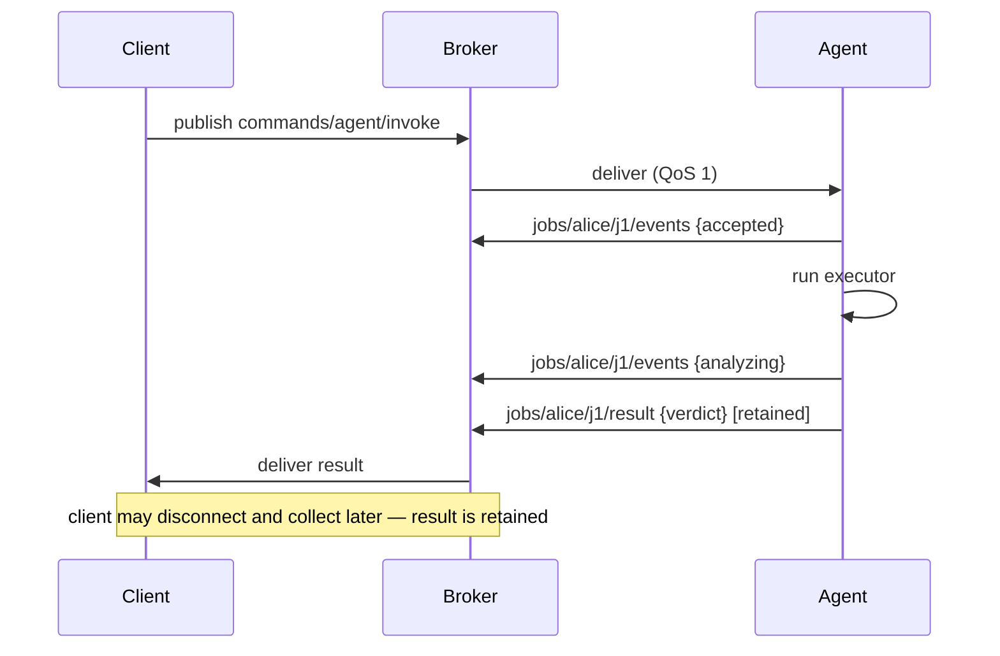
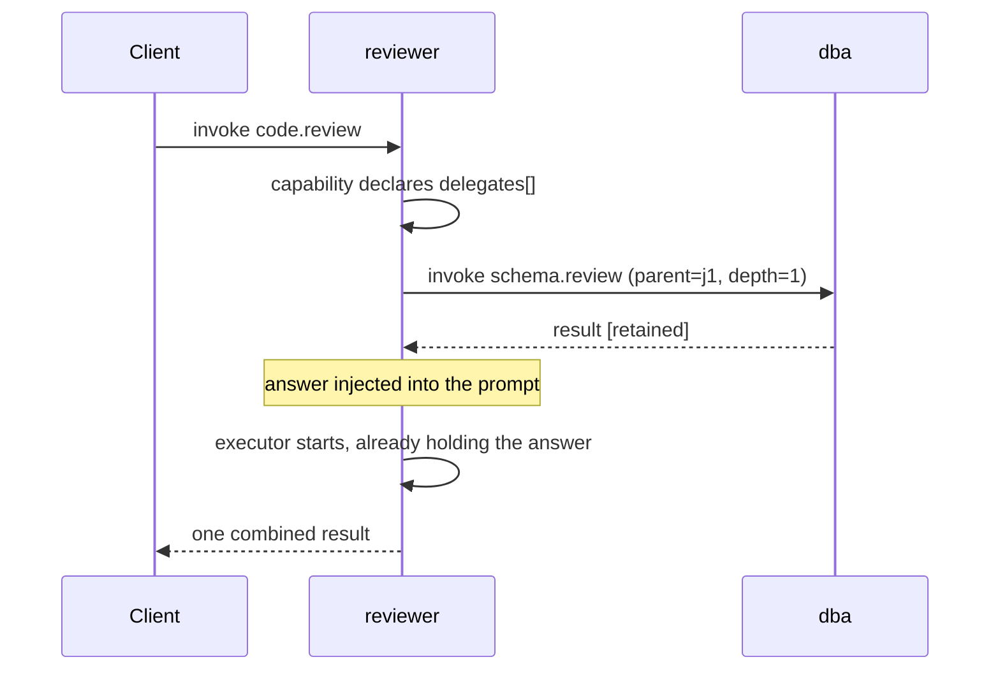
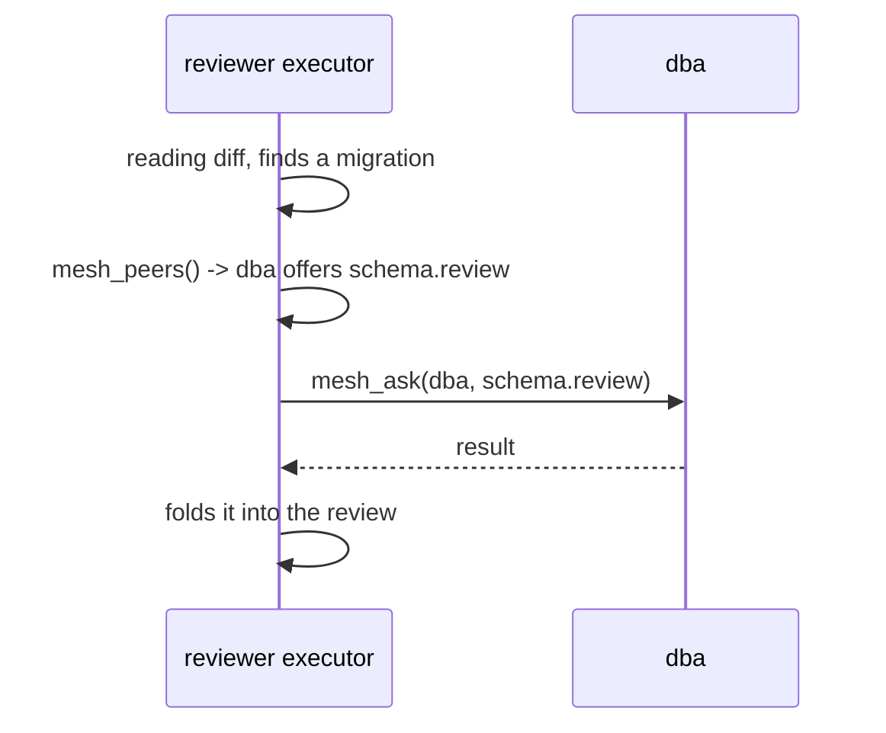
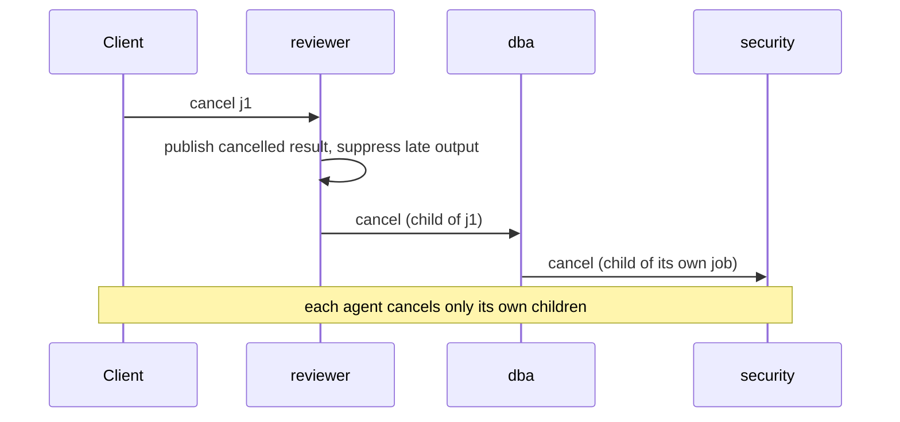

# Plexus — Agent Mesh Protocol v1.3

A protocol for autonomous agents to dispatch work to each other over MQTT — across laptops,
VPNs and containers, none of which can accept an inbound connection. Broker root: `agents`.

Delivery is **push end to end**. Nothing on a delivery path polls: the broker pushes over a
persistent MQTT session, the plugin pushes the job into an executor subagent the moment it
arrives, results are pushed back at QoS 1 (retained), and the web panel receives Server-Sent
Events. The only periodic timers left are a supervisory watchdog and a slow filesystem
reconciler, neither of which carries a message.

## Why MQTT

An agent is not a service. It is intermittent, slow, context-bound to a machine, and liable to
stop existing halfway through a thought. Treating it as an HTTP endpoint means rebuilding, in
application code, every mechanism that already exists in a transport designed for exactly this
shape.

| The agent's reality | What the transport already provides |
|---|---|
| Offline for hours at a time | Persistent session: work is **queued and delivered on reconnect** |
| Unknown to its peers | **Retained** capability profile — discovery with no announcement round |
| Thinks for minutes | Streamed milestones, terminal result **retained** for late collection |
| Dies mid-task | Last will: presence published **by the broker**, not by a heartbeat service |
| One of many requesters | Per-owner isolation as a **subscription filter**, enforceable in broker ACLs |
| Behind NAT or a VPN | One outbound connection; nothing exposed |

Every guarantee below is a property of the transport, not of this implementation. That is what
makes the protocol small enough to implement in an afternoon — see
[`examples/minimal-agent.mjs`](examples/minimal-agent.mjs).

## Delivery guarantees

Stated exactly, because "reliable" means nothing on its own.

| Message | Delivery | Retained | Notes |
|---|---|---|---|
| `invoke` | **at-least-once** | no | QoS 1. A redelivery after reconnect can duplicate a job; the bridge rejects a `jobId` already active |
| `events` | **at-least-once** | no | A subscriber joining mid-job sees no earlier milestones. Progress is advisory, never a source of truth |
| `result` | **at-least-once** | **yes** | Last write wins. Readable indefinitely by clients that connect afterwards |
| `profile` / `status` | **at-least-once** | **yes** | Empty payload deletes the retained message and means the agent has left |

**Ordering** holds per topic only. `events` and `result` are different topics: a terminal result
may be observed before a milestone published earlier. Never infer sequence across topics — use
the `ts` field.

**Durability** covers the window in which an agent is disconnected, and depends entirely on the
client id being stable. With a changing id every reconnect is a new session, and jobs published
during the gap are lost with the old one.

**Exactly-once is not offered.** MQTT QoS 2 would give it hop-by-hop and still not end-to-end,
because an executor can complete work and die before publishing. Assume at-least-once and make
capabilities idempotent.

## Job lifecycle

```
                    ┌──────────┐
   invoke ─────────▶│ accepted │
                    └────┬─────┘
                         │ executor dispatched
                    ┌────▼─────┐
              ┌─────│ started  │─────┐
              │     └────┬─────┘     │
   executor   │          │           │  cancel
   publishes  │          │ watchdog: │
   result     │          │ silent +  │
              │          │ settled   │
        ┌─────▼────┐ ┌───▼──────┐ ┌──▼────────┐
        │   done   │ │ timeout  │ │ cancelled │
        └──────────┘ └──────────┘ └───────────┘

   rejected  ── refused before any work: unknown service, missing requestedBy,
                depth exceeded, owner mismatch
   duplicate ── a jobId already active
```

Terminal states are `done`, `error`, `timeout`, `cancelled`, `rejected`, `duplicate`. **Every
path reaches one**, and each publishes a retained result — a client is never left waiting on a
job that quietly stopped existing.

`started` may be re-entered once per watchdog re-dispatch, bounded by `maxDepth`-independent
retry limits. Re-entry is visible as a `requeued` event on the timeline.

## Sequence

A directed job:



Declared delegation — the bridge gathers dependencies *before* the executor starts:



Dynamic delegation — the executor discovers the need mid-job:



Cancel propagates down a chain without any agent knowing its shape:



## Failure modes

What actually happens, rather than what is hoped for.

| Situation | Behaviour |
|---|---|
| **Broker unreachable** | Agent retries every 5s. Jobs published meanwhile are queued by the broker and delivered on reconnect, provided the client id is stable |
| **Agent offline when a job is published** | Queued in its persistent session, delivered on reconnect. This is the main reason `clean: false` matters |
| **Agent restarts mid-job** | In-memory job state is lost; the executor's own retained result still lands. The watchdog does not survive the restart, so a job whose executor also died goes unresolved |
| **Executor finishes without publishing** | Watchdog re-dispatches after the silence window, up to twice, then publishes a terminal `error`. Re-dispatch can duplicate work if the capability is not idempotent |
| **Executor never terminates** | `maxJobDurationMs` publishes a terminal error regardless of liveness |
| **Peer never answers a delegated ask** | `askTimeoutMs` fails the ask. Declared: optional dependency degrades, required fails the job before the executor starts |
| **Delegation cycle (A→B→A)** | `maxDepth` refuses **before publishing** — a cycle allowed to start would run until something else stopped it |
| **Duplicate `jobId`** | Rejected with a `duplicate` result if already active. Note ids are not namespaced by asker, so two agents *can* collide |
| **Unknown service** | Rejected with a terminal `error` naming the service |
| **Missing `requestedBy`** | Rejected. The error goes to `jobs/public/<id>/result`, not the sender's scope — a client that omitted it will not see the rejection on its own filter |
| **Result exceeds broker message limit** | Publish fails at the broker. No chunking exists; large payloads should be published elsewhere and referenced |
| **Two agents share a client id** | Broker kicks each in turn. Detected at 5+ connects in 60s; the bridge takes a distinct id and reports degraded durability |

## Registry (retained)

| Topic | Direction | Payload |
|---|---|---|
| `agents/registry/<agentId>/profile` | agent → all (retained) | `{ agentId, displayName, status, protocolVersion, capabilities[], ownerPolicy }` |
| `agents/registry/<agentId>/status` | agent → all (retained + LWT) | `{ status: online\|offline }` |

`ownerPolicy` is `{ required: bool, verified: bool }` — it tells you what this deployment
actually enforces, so you never have to infer enforcement from the version number.

## Commands

| Topic | Direction | Notes |
|---|---|---|
| `agents/commands/<agentId>/invoke` | you → agent | `{ service, args, requestedBy, jobId? }` — **`requestedBy` is REQUIRED and is now enforced** |
| `agents/commands/<agentId>/query` | you → agent | `{}` lists services; `{ jobId }` checks state. Reply on `.../query/reply` |
| `agents/commands/<agentId>/cancel` | you → agent | `{ jobId, requestedBy }`. Reply as a terminal `cancelled` result |
| `agents/commands/<agentId>/config` | you → agent | service CRUD. Reply on `.../config/reply` |

## Capabilities are data, not code

The bridge is **capability-agnostic**. It contains no service name — not `code.review`, not
anything else. A capability is a JSON entry in `services.json`:

```json
{ "service": "code.review",
  "description": "…",
  "requestSchema": { "repo": "string (owner/name)", "pr": "number" },
  "handler": "session",
  "prompt": "Review pull request {{pr}} in {{repo}}. …" }
```

`invoke` names a `service`; the bridge looks it up, renders its `prompt` with `{{jobId}}`,
`{{requestedBy}}` and each key of `args`, and hands the result to an executor. That is the
entire coupling. Everything domain-specific lives in the prompt template.

Capabilities can be added, updated and removed at runtime over the `config` command (or the
panel) with no restart and no code change — the retained profile republishes automatically.
The catalog shipped here is an **example**; replace it wholesale for a different domain and
the transport is unchanged.

### Deployment values: `${ENV_VAR}` in prompts

A capability definition should stay portable, but real prompts need deployment-specific
values — Slack ids, channel names, internal repo paths. Reference them as `${VAR}`:

```json
"prompt": "Review PR {{pr}} in {{repo}}. DM the summary to ${SLACK_REVIEW_RECIPIENTS}."
```

and supply them per deployment, either in plugin config:

```jsonc
"mesh": {
  "promptVars": { "SLACK_REVIEW_RECIPIENTS": "U07XXXXXXX,U08YYYYYYY" }
}
```

or from the environment. **Config is checked first**, then `process.env`. Prefer config for
identifiers — it is versioned with the rest of your deployment and survives any regeneration
of a service-managed environment file. Keep genuinely secret values in the environment.

The point of the split: one `services.json` runs everywhere, and only the variable bindings
change. Without it, every deployment forks the catalog and every upstream catalog change has
to be merged by hand.

Two properties make this safe, and both are deliberate:

- **Resolved at dispatch, never in the catalog.** The capability list is published to the
  *retained* profile topic. Resolving there would broadcast every deployment value to anyone
  subscribed to the registry. On the wire the prompt stays a template; substitution happens
  only on the way to the executor.
- **Environment first, then arguments.** `${…}` is expanded *before* `{{args}}`, so a value
  arriving in an invoke argument is never itself expanded. Were the order reversed, any caller
  could pass `"${SOME_SECRET}"` as an argument and have the bridge read it back — turning
  every invoke into an environment read.

An unset variable substitutes empty and logs a warning; it never leaks the literal `${NAME}`
into the executor's instructions.

Note the boundary this respects: env vars supply *identifiers and configuration*, not
credentials for the mesh to use. Authentication still belongs to the executor.

## Delegation: agents asking agents

Each agent owns distinct capabilities. An agent that meets work outside its own asks the agent
that owns it — a human simply enters the mesh at one agent, and work flows from there.

Requests are **directed, never broadcast**. `invoke` names one agent, so a receiving agent never
decides whether to serve: it was addressed for a capability it publishes, so it does the work.
There is no bidding and no contention. The only choice happens on the **asking** side — which
agent to ask — which is why every agent subscribes to the registry.

### Discovery

Every agent subscribes to the retained registry of the whole mesh:

```
<root>/registry/+/profile      capabilities of every agent
<root>/registry/+/status       who is online
```

Because both are retained, an agent learns the entire mesh the moment it subscribes — no
announcement round, no waiting for peers to speak. An agent's own profile arrives on the
wildcard and is ignored.

### Requirement: the executor must have the tools

Both forms depend on the host exposing the plugin's tools to the agent. Under OpenClaw that
means `tools.alsoAllow` must list `mqtt_publish`, `mesh_ask` and `mesh_peers`, because a tool
profile otherwise filters plugin tools out entirely.

This fails quietly and is worth checking first: without `mqtt_publish` an executor cannot
publish its result and jobs appear to hang or get re-dispatched by the watchdog; without
`mesh_ask` dynamic delegation simply never occurs.

Declared delegation still works without `mesh_ask`, because the bridge performs those asks
itself — which is one reason to prefer it where the dependency is known in advance.

### Two ways to delegate

They fail differently, so a deployment chooses with `mesh.delegation`.

**Declared** — a capability lists what it depends on. The bridge performs those
asks *before* the executor starts and hands it the answers:

```json
{ "service": "code.review",
  "prompt": "Review PR {{pr}} in {{repo}}.",
  "delegates": [
    { "agent": "dba", "service": "schema.review", "as": "schemaReview",
      "args": { "migration": "{{migration}}" }, "required": false }
  ] }
```

Independent dependencies run concurrently. Each answer is injected under its `as` name in a
`CONTEXT FROM OTHER AGENTS` block. A `required` dependency that fails fails the job before the
executor starts, with a terminal result published so nobody waits; an optional one lets the job
proceed and tells the executor it could not be answered.

Declared delegation is **deterministic**: it needs no tool in the executor's session and does not
depend on the executor choosing to delegate. What it cannot do is adapt to what a job turns out
to need.

**Dynamic** — the executor calls `mesh_ask` mid-job, having found the peer with `mesh_peers`.
Flexible, and the only option when the need is discovered rather than known in advance. It
depends on the executor deciding to call the tool, and on tools being reachable from its session.

| `mesh.delegation` | Declared | `mesh_ask` |
|---|---|---|
| `both` *(default)* | ✅ | ✅ |
| `declared` | ✅ | ✅ refused, with the reason |
| `dynamic` | ✅ ignored | ✅ |
| `off` | ✅ ignored | ✅ refused |

When dynamic is unavailable the executor's briefing omits the peer directory entirely, rather
than advertising a tool that will refuse.

### Asking

An ask is an ordinary `invoke` to the peer's command topic, with `requestedBy` set to the
**asking agent's id**. Results therefore route to the asker's own owner scope, which it already
subscribes to — that is the return path.

```json
{ "service": "schema.review",
  "args": { "migration": "…" },
  "requestedBy": "conan",
  "jobId": "ask-mt7k2p-9f3c",
  "parentJobId": "rev-118",
  "rootJobId": "rev-118",
  "depth": 1 }
```

The asking agent **waits** for the terminal result and uses it in its own work. That is the point
of delegation: conan asks dba because it needs dba's answer to finish, so the entry agent returns
one complete reply rather than the requester assembling fragments.

### Lineage

Every ask creates **its own job with its own id**. A chain of agents is a chain of jobs, not one
job passed around, so three fields link them:

| Field | Meaning |
|---|---|
| `parentJobId` | the job that asked for this one |
| `rootJobId` | the original request every job in the chain shares |
| `depth` | hops from the root; `0` entered the mesh directly |

```
rev-118    parent —          root rev-118    depth 0
ask-9f3c   parent rev-118    root rev-118    depth 1
ask-2b71   parent ask-9f3c   root rev-118    depth 2
```

Without this, a five-agent chain is five unrelated ids: a failure cannot be attributed to the
request that caused it, and a cancel has no way to find what to stop.

### Hop limit

`mesh.maxDepth` (default `4`) bounds the chain. A request arriving deeper than the limit is
**rejected before any work starts** — a cycle allowed to begin is a cycle that runs until
something else stops it. The asking side refuses too, so nothing reaches the wire.

### Cancel propagation

Cancelling a job cancels everything it delegated: the bridge publishes `cancel` to each peer it
asked, and those peers cancel *their* children in turn. One cancel unwinds the whole chain
without any agent needing to know its shape.

### What this does not solve

Delegation inherits the trust model below. `requestedBy` on an ask is the asking agent's
self-declared id, exactly as with a human requester — a peer cannot verify who really asked
unless the broker enforces it.

## Credentials & scope boundary

**The bridge carries jobs, not credentials.** It holds exactly two secrets: the broker
username/password, and the optional `web.auth` panel token. It has no GitHub, cloud or
third-party authentication of any kind, and no code path that acquires or forwards one.

Service credentials belong to the **executor**, which authenticates with the host's own
configured identity (for example an already-authenticated `gh` CLI). This follows directly
from "transport in the framework, logic in the agent": an agent that needs to read a private
repository is exercising its own authority, not authority delegated through the mesh.

Never place tokens in `invoke` args. Payloads are readable by every subscriber to that topic,
and results are **retained on the broker**, so a secret published once persists until it is
explicitly overwritten.

## Durability

The bridge holds one **persistent session**: `clean: false`, QoS 1 on every subscription,
30-second keepalive, 5-second auto-reconnect, LWT for presence. The connection is outbound
only, so it works behind NAT.

Durability depends on the **client id being stable across restarts**. It is derived from
hostname + install path — never from the process id. This matters more than it looks: with a
changing id, every restart is a *new* MQTT session, so the broker's queued QoS-1 messages stay
orphaned with the dead session and any `invoke` published while the gateway was down is lost
silently. It also leaked one abandoned session per restart, since MQTT 3.1.1 has no session
expiry.

- An `invoke` published while the bridge is down is **queued by the broker and delivered on
  reconnect**.
- If you genuinely run two gateways from the same install directory, set `broker.clientId`
  explicitly on one of them. Session durability and multi-instance safety are in tension and
  the operator has to choose. A collision manifests as a kick-loop, which the bridge detects
  and logs explicitly rather than letting it look like flaky networking.
- Set `broker.protocolVersion: 5` to get a bounded `sessionExpirySeconds` (default 24h), so a
  decommissioned deployment stops accumulating queued messages forever.

In-memory job tracking (`activeJobs`, history) does not survive a restart. Retained results
replay on resubscribe, so completed jobs reappear; jobs in flight across a restart are no
longer watched and rely on the executor publishing its own retained result.

## Identity & trust model

MQTT delivers **topic + payload only** to subscribers. No username, no client id — the
publisher's broker identity never travels with the message. Therefore:

- `owner` is **self-declared**: whatever string the sender puts in `requestedBy`.
- With the default configuration, that string is *required* but not *authenticated*. Anyone
  with broker credentials can claim any owner scope by forging `requestedBy`.
- Privacy/isolation is therefore **conventional, not enforced**, unless you enable
  verification below.

### Optional owner verification (`mesh.verifyOwner`)

The bridge can verify `requestedBy` against a broker-injected `client_username`, using an EMQX
rule-engine payload enrichment. When enabled it **fails closed**: an invoke that arrives
without `client_username` is rejected, and one whose `requestedBy` disagrees with the broker
identity is rejected with the mismatch reported.

This is **off by default** because it requires broker-side setup first. Wire the EMQX rule, then
turn it on. Until you do, `ownerPolicy.verified` is `false` in the profile and clients should
treat owner scoping as a convention.

Stronger isolation remains a broker-side concern: EMQX ACLs (`subscribe jobs/${username}/#`,
publish `commands/+/invoke`) enforce it at the boundary rather than in the agent.

## Owner

`owner` scopes job traffic so each requester only receives their own jobs:

- `owner` = `requestedBy` from the invoke payload, lowercased, restricted to `[a-z0-9_-]`
  (anything else → `-`), trimmed.
- **Set `requestedBy` to your stable username** (e.g. `mohanad`, `ci-github`, `kg`). It's the
  same value for invoke and for your subscription filter.
- **Omitting it is rejected.** The job is refused and a `type: "error"` result is published to
  `jobs/public/<jobId>/result` so the failure is never a
  silent drop. Previously such jobs were quietly routed to `public`, where the sender's own
  subscription filter would never see them.
- Set `mesh.requireOwner: false` to restore the lenient behaviour, which accepts the invoke,
  logs a warning, and scopes it to `public`.
- Anyone subscribing the flat `jobs/#` still sees everything (the agent's own panel does this) —
  clients shouldn't.

## Job lifecycle topics

```
agents/jobs/<owner>/<jobId>/events    milestones: accepted, started, diff-fetched, analyzing, result-ready…
agents/jobs/<owner>/<jobId>/result    terminal payload, RETAINED, QoS 1
```

Every result carries `jobId`, `owner`, `ts`, and `type`. Known types: `review`,
`already_reviewed`, `error`, `duplicate`, `cancelled`, and the generic `result`. The list is
open — treat an unrecognised `type` as terminal.

**These guarantees are enforced by the bridge, not by the executor.** Any publish to a job
topic through the `mqtt_publish` tool is normalised on the way out: `jobId`, `owner` and `ts`
are injected from the topic if absent, `type` is defaulted, and **`retain` is forced true on
result topics**. Conformance no longer depends on the executor remembering to set the flag —
a forgotten `retain: true` used to mean late subscribers saw nothing at all.

Events are QoS 1 and deliberately **not** retained: a subscriber joining mid-job sees the
retained result but not earlier milestones.

Job topics are **always owner-scoped**. There is no unscoped `jobs/<jobId>/…` form: a result
belongs to exactly one owner and is published to exactly one topic.

## Cancellation

`cancel` is **cooperative and terminal at the mesh boundary**:

1. `cancel_acknowledged` is published to the job's event stream.
2. A retained `type: "cancelled"` result is published, so listeners are never left waiting on a
   job that will never report.
3. Any later publish from the executor for that job is **suppressed**, keeping the client's view
   consistent with the acknowledgement.
4. The executor's session is dropped on a best-effort basis to stop it consuming budget.

What it does **not** guarantee is immediate termination of in-flight work. The plugin runtime
exposes `run`, `waitForRun`, `getSession` and `deleteSession` — there is no abort primitive — so
an executor mid-tool-call may run to completion internally. Its output is discarded rather than
published. Treat `cancelled` as "no further traffic and no result will be honoured", not as
"the compute stopped".

## Execution & liveness

Jobs are pushed straight into an isolated executor subagent at arrival — no heartbeat, no queue,
so a busy or failing main session cannot swallow a job. If the runtime has no subagent API, the
bridge falls back to a system-event enqueue plus heartbeat wake, which is the only pull-shaped
path that remains, and only on older runtimes.

A supervisory watchdog sweeps every 60 seconds. Its liveness signal is **whether the executor's
run has settled**, not whether the executor has been chatty:

- Run still in flight → alive by definition, never re-dispatched.
- Run settled without a published result → re-dispatched, up to 2 times, then a terminal
  `error` result.
- Fallback path with no run handle → falls back to a 5-minute silence heuristic.
- Any job exceeding `mesh.maxJobDurationMs` (default 30 min) fails with a terminal error
  regardless of liveness.

The previous heuristic re-dispatched any job that worked *silently* for five minutes, which a
large PR review does routinely — causing duplicate execution of exactly the most expensive
jobs. Executors are still asked to publish a milestone every two minutes, but correctness no
longer depends on their doing so.

## What you should subscribe to

As a job sender with username `mohanad`:

```
agents/jobs/mohanad/#          ← your jobs: events + results (recommended)
agents/jobs/mohanad/+/result   ← only final results, no progress noise
agents/commands/conan/query/reply    ← if you use query
```

Do NOT subscribe `agents/jobs/#` — that's the pre-1.1 firehose of everyone's jobs.

As the agent (conan) itself: the four `commands/conan/*` topics + `agents/jobs/#` (full
history for the web panel).

## Example flow

1. Publish `agents/commands/conan/invoke`:
   ```json
   { "service": "code.review", "requestedBy": "mohanad",
     "args": { "repo": "owner/repo", "pr": 1234 } }
   ```
2. Listen on `agents/jobs/mohanad/#`.
3. Events arrive as `.../jobs/mohanad/<jobId>/events`; the final review (retained) lands on
   `.../jobs/mohanad/<jobId>/result`.

Omit `requestedBy` and step 1 is rejected — you'll find the error on
`agents/jobs/public/<jobId>/result`, not on your own scope.

## Web control panel

A front end **for** this plugin; no MQTT in the browser. Served on `127.0.0.1:8765` by default.

| Route | Purpose |
|---|---|
| `GET /api/profile` | catalog + connection state |
| `GET /api/status` | broker stats (uptime, rx/tx, reconnects) |
| `GET /api/jobs` | active jobs + recent history |
| `GET /api/events` | **SSE stream** of job/status/profile changes |
| `POST /api/invoke` | `{ service, args, requestedBy, jobId? }` |
| `POST /api/cancel` | `{ jobId, requestedBy }` |
| `POST /api/config` | service CRUD |

The panel consumes the SSE stream and only falls back to polling if the stream drops. Set
`web.auth` to require a bearer token — it is accepted as an `Authorization` header, or as
`?token=` for the SSE stream, since `EventSource` cannot set headers. This setting was
previously declared but never enforced; it is now enforced on every route.

## Changes v1.2 → v1.3

Delegation, which is what makes this a mesh rather than a set of agents sharing a broker:

- Agents subscribe to `registry/+/profile` and `registry/+/status` and keep a live peer
  directory. Previously every agent published a catalog that nobody read.
- An agent can ask a peer and **receive the answer**. Publishing to a peer was always possible;
  the return path was not, so an agent could notify a peer but never use its reply.
- `parentJobId`, `rootJobId` and `depth` link the jobs of one request into a traceable chain.
- `mesh.maxDepth` bounds chain length, refusing before anything is published.
- Cancelling a job cancels what it delegated, recursively.
- Two delegation forms, selected by `mesh.delegation`: capability-declared dependencies gathered
  by the bridge before the executor starts, and the `mesh_ask` tool for needs discovered mid-job.

## Changes v1.1 → v1.2

Protocol:
- `requestedBy` is enforced, not merely documented as required. Rejections are published rather
  than silently rerouted to `public`.
- Optional broker-identity verification (`mesh.verifyOwner`), fail-closed, off by default.
- `ownerPolicy` advertised in the profile and in `query` replies, so clients can read the
  deployment's actual enforcement instead of inferring it.
- `cancelled` added as a terminal result type; cancel now always produces a terminal result.

Conformance fixes:
- Result payload shape and the retained flag are guaranteed by the bridge rather than by
  executor prompt-following.

Removed:
- The v1.0 compatibility layer is gone: no unscoped `jobs/<jobId>/result` mirror, no legacy
  request topic, and no `topics` config block. It existed only to carry a single deployment
  through the 1.0 → 1.1 migration, and it forced a service name into the transport layer.
- With it goes the last hardcoded capability. The bridge no longer contains the string
  `code.review`, or any other service name.

Durability & delivery:
- Client id is stable across restarts, so `clean: false` actually persists the session and
  invokes published during downtime survive.
- Optional MQTT 5 with a bounded session expiry.
- Web panel moved from a 2.5-second poll to Server-Sent Events.
- `services.json` changes detected via `fs.watch` instead of a 30-second mtime poll.
- Watchdog liveness switched from executor chattiness to run settlement, removing duplicate
  execution of long silent jobs; hard per-job duration cap added.
- `web.enabled` and `web.auth` are honoured; both were previously no-ops.
