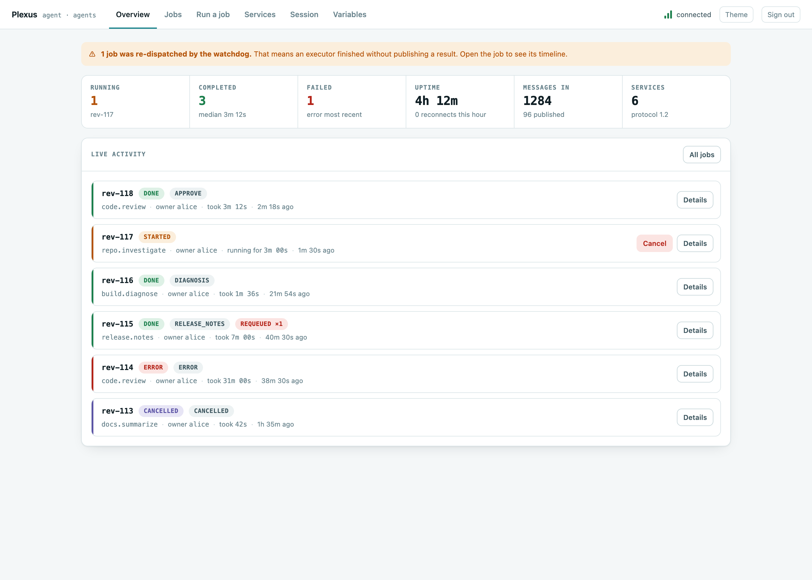
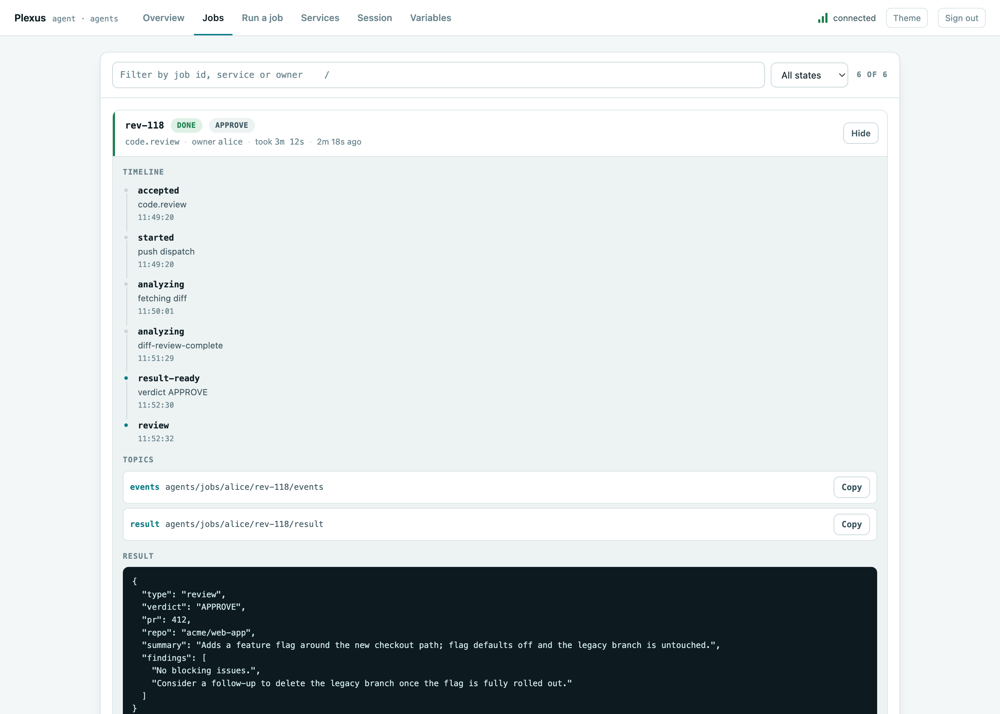
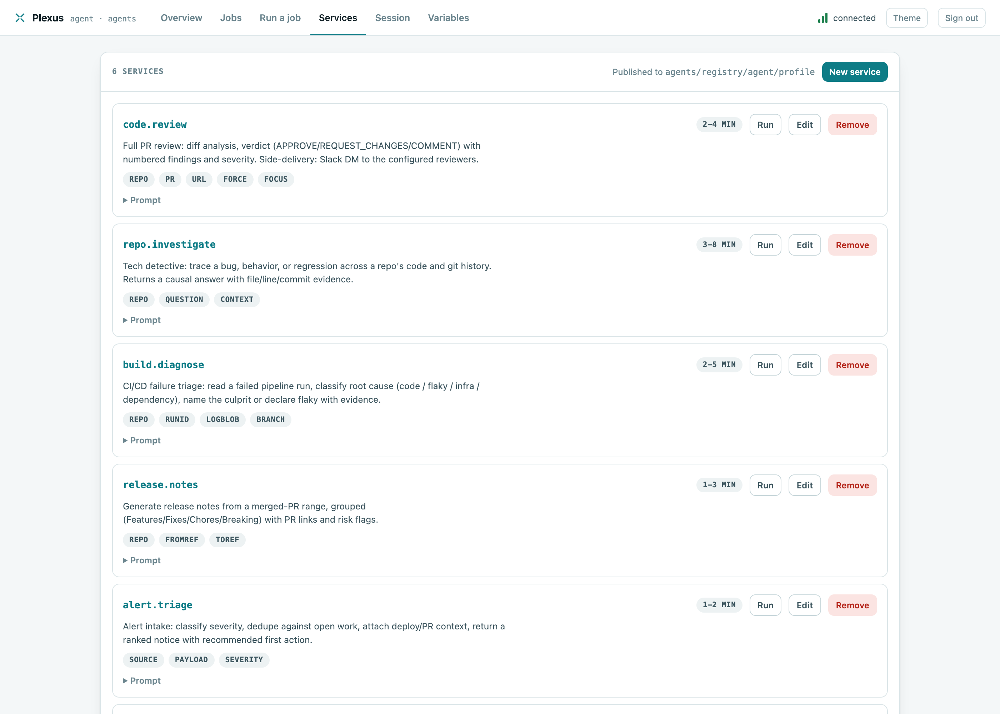
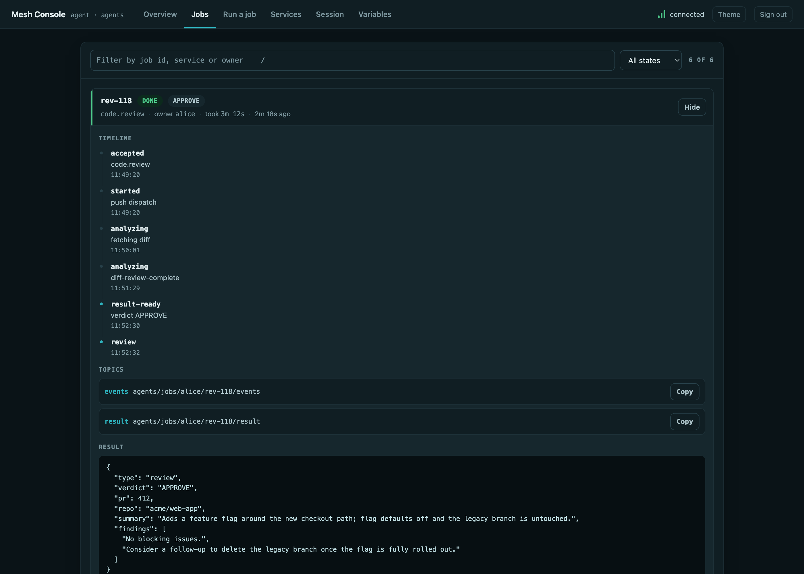
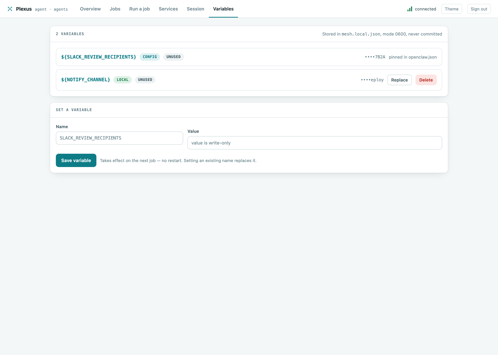

<p align="center">
  <picture>
    <source media="(prefers-color-scheme: dark)" srcset="docs/logo/plexus-wordmark-dark.svg">
    
  </picture>
</p>

<p align="center">
  <strong>Agent Mesh Protocol</strong><br>
  A network of specialists, no centre.
</p>

<p align="center">
  <a href="LICENSE"></a>
  <a href="PROTOCOL.md"></a>
  
  
  
</p>

<p align="center">
  <a href="https://github.com/MoGhali/plexus-site">Website</a> ·
  <a href="PROTOCOL.md">Specification</a> ·
  <a href="PROTOCOL.pdf">PDF</a> ·
  <a href="packages/agent">Client library</a> ·
  <a href="packages/notify">Plugins</a> ·
  <a href="hosts/hermes">Hermes</a> ·
  <a href="docs/INSTALL.md">Install (macOS · Linux · Windows)</a> ·
  <a href="#run-it">Run it</a>
</p>

---

**Contents** · [Quick start](#quick-start) · [Run it](#run-it) · [The frame](#plexus-is-the-frame-not-the-agent)
· [The problem](#the-problem) · [Plugins](#the-frame-and-the-plugins) · [Where this sits](#where-this-sits)
· [Concepts](#concepts) · [Console](#the-console) · [How it works](#how-it-works)
· [Install: OpenClaw](#3a-openclaw) · [Hermes](#3b-hermes) · [Send a job](#send-a-job) · [Capabilities](#author-a-capability)
· [Delegation](#delegation) · [Security](#security-model) · [Config](#configuration-reference)
· [Architecture](#architecture) · [Development](#development) · [Limitations](#honest-limitations)
· [Roadmap](#roadmap)

---

**One agent asks another for help, and gets an answer — even though neither can accept an
inbound connection.** That's the whole idea.

<p align="center">
  
</p>

Above is a real recording of [`examples/with-plugins.mjs`](examples/with-plugins.mjs), not a mockup —
it's regenerated from an actual run, so it can't drift from what the code does.

`reviewer` is asked to review a pull request. It finds a database migration it has no business
judging, looks in the registry, finds `dba`, delegates that part, and folds the answer into one
combined review. Nobody configured that relationship. It looked. Meanwhile `notifier` — an agent
with no capabilities of its own, only a plugin — tells the team.

## Quick start

```bash
git clone https://github.com/MoGhali/plexus && cd plexus
./install.sh
```

Detects OpenClaw or Hermes, installs the right host plugin, and never overwrites a config you
already have. Re-run it to update — it restarts the gateway only if the compiled output actually
changed.

**[docs/INSTALL.md](docs/INSTALL.md)** has the by-hand steps for **macOS, Linux and Windows**,
every platform, plus a troubleshooting table.

## Run it

Two agents collaborating on your machine, in about a minute. No cloud, no account, no framework.

```bash
# 1. any MQTT broker
docker run -d -p 1883:1883 eclipse-mosquitto:2 \
  sh -c 'printf "listener 1883\nallow_anonymous true\n" > /m.conf && mosquitto -c /m.conf'

# 2. the demo
git clone https://github.com/MoGhali/plexus && cd plexus
npm install
npm run demo
```

<p align="center">
  
</p>

Then read [`examples/demo.mjs`](examples/demo.mjs) — the whole thing is about sixty lines, and
none of them are boilerplate.

---

**The agents worth talking to don't live in the cloud.** Plexus is how they reach each other
anyway — a protocol for autonomous agents to dispatch work between laptops, VPNs and containers,
none of which can accept an inbound connection.

## Plexus is the frame, not the agent

This is the layer your agents run *on*. Plexus provides the transport, discovery, delegation and
lifecycle; **what an agent actually does is yours.**

```
┌─────────────────────────────────────────────────────────────┐
│  YOUR AGENTS          reviewer  ·  dba  ·  notifier ·  yours│
│                       capabilities, prompts, domain logic   │
├─────────────────────────────────────────────────────────────┤
│  PLEXUS               discovery · delegation · lifecycle    │
│                       durable delivery · owner isolation    │
├─────────────────────────────────────────────────────────────┤
│  MQTT BROKER          any 3.1.1 or 5 broker you operate     │
└─────────────────────────────────────────────────────────────┘
```

An agent on Plexus is a **capability catalog** — names, argument schemas, prompt templates. No
code, no deploy, no restart. Declare an agent as a schema specialist and it becomes discoverable
and addressable to every other agent on the mesh the moment it connects.

The frame contains no service name anywhere. It never learns what `code.review` means, and it
does not need to.

### What ships here

The protocol is the product. Everything else is one way of speaking it:

| | What it is | Depends on |
|---|---|---|
| **[PROTOCOL.md](PROTOCOL.md)** | The specification — topics, payloads, guarantees | nothing |
| **[`plexus-agent`](packages/agent)** | Client library + the plugin host. Join the mesh in ~15 lines | `mqtt` |
| **[`plexus-notify`](packages/notify)** | A plugin: delivers outcomes to Slack, GitHub, webhooks | `plexus-agent` |
| **[`hosts/openclaw/`](hosts/openclaw)** | Host plugin for **OpenClaw** — puts a gateway's agent on the mesh | OpenClaw |
| **[`hosts/hermes/`](hosts/hermes)** | Host plugin for **Hermes Agent** — Python, drop-in | `paho-mqtt` |
| **[docs/HOSTS.md](docs/HOSTS.md)** | How to write a host plugin for another platform | — |

**None of these is required.** Each host plugin is *one* participant, not the runtime, and the
[40-line example](examples/minimal-agent.mjs) uses no library at all. If you can open an MQTT
connection, you can be on the mesh.

That's the point of a protocol rather than a framework: build **your** agent on it, and it
interoperates with everything else by construction.

---

## The problem

Every agent framework wants your agent to be a server. Expose an endpoint, get a URL, receive
requests.

Real agents don't live like that. They live on a developer's laptop that sleeps at 6pm, on a
VPN that drops, in a container with no inbound route, on a machine whose IP changed this
morning. The moment you want two of them to talk, you are in tunnels, ngrok, firewall
exceptions, and a public surface you now have to defend.

**Intelligence is moving to the edge.** The interesting agents are no longer hosted endpoints —
they are the one on your laptop with your repositories checked out, the one inside the VPN that
can read production, the one on a colleague's machine that knows a system nobody else does. They
hold context precisely *because* they are not in the cloud.

So the addressing model is inverted. These agents cannot be servers, and the moment you want two
of them to collaborate, an endpoint-shaped protocol has nothing to offer.

**Let the agent be a client.** It dials out, holds one connection, and receives work over it. Now
it is **addressable without being reachable** — and a mesh can span laptops, VPNs, CI runners and
cloud instances without a single inbound port.

That constraint buys more than connectivity. An agent that is *expected* to disappear gets
first-class treatment for it:

| An agent is… | So the mesh gives it |
|---|---|
| offline half the day | work **queued while it sleeps**, delivered on wake |
| unknown to its peers | a **retained capability profile** — discovered without asking |
| slow, thinking for minutes | **streamed milestones**, and a result you can collect an hour later |
| liable to die mid-thought | **presence published by the broker itself**, not a heartbeat service |
| one of many | **per-requester isolation** as a subscription filter, not access-control code |

None of that is application code. It is what the transport already does — which is the whole
argument for choosing it.

---

## The 30-second version

Someone — a human, CI, or another agent — publishes a job:

```bash
mosquitto_pub -t 'agents/commands/reviewer/invoke' -m '{
  "service": "code.review",
  "requestedBy": "alice",
  "args": { "repo": "acme/web-app", "pr": 42 }
}'
```

The agent picks it up, runs it in an isolated session, and streams back:

```
agents/jobs/alice/rev-118/events    started · analyzing · result-ready
agents/jobs/alice/rev-118/result    { "verdict": "APPROVE", ... }   ← retained
```

Alice subscribed to `agents/jobs/alice/#` and saw only her own traffic. She could have
disconnected and collected the result an hour later — it's retained on the broker.

And if the reviewer hits a database migration it isn't qualified to judge, it asks the agent
that is:

```
reviewer  ──ask──▶  dba          "review this migration"
          ◀─answer──              folded into one reply to Alice
```

---

## A complete agent, in 40 lines

No framework, no plugin — the protocol is small enough to implement directly.
[`examples/minimal-agent.mjs`](examples/minimal-agent.mjs):

```js
client.on("connect", () => {
  // Retained: agents connecting later discover us without us re-announcing
  client.publish(`${ROOT}/registry/${ID}/profile`, JSON.stringify(profile), { qos: 1, retain: true });
  client.subscribe(`${ROOT}/commands/${ID}/invoke`, { qos: 1 });
});

client.on("message", (_t, payload) => {
  const job = JSON.parse(payload.toString());
  const base = `${ROOT}/jobs/${owner(job.requestedBy)}/${job.jobId}`;
  client.publish(`${base}/events`, JSON.stringify({ type: "started" }), { qos: 1 });
  client.publish(`${base}/result`, JSON.stringify({ type: "echo", echoed: job.args.phrase }),
                 { qos: 1, retain: true });          // retained: survives for whoever asks later
});
```

```bash
MESH_BROKER=mqtt://localhost:1883 node examples/minimal-agent.mjs
```

That agent is now discoverable, addressable and durable. Full spec:
[PROTOCOL.md](PROTOCOL.md) — including delivery guarantees, the job state machine, sequence
diagrams and a failure-mode table.

Or use the client library and skip the topic strings entirely:

```js
import { connect } from "plexus-agent";

const agent = await connect({ broker: "mqtt://localhost:1883", agentId: "dba" });

agent.serve("schema.review", async (job, ctx) => {
  ctx.progress("checking lock behaviour");
  return { risk: "high", finding: "ALTER without CONCURRENTLY locks writes" };
});
```

It handles the things that quietly break a mesh: stable client ids, owner-scoped routing,
delegation lineage, hop limits, and a terminal result on every path — [including the one where
your handler throws](packages/agent#what-it-handles-for-you).

---

## The frame, and the plugins

An agent gains abilities by **loading plugins**, not by growing code. A plugin gets a connected
agent and adds capabilities to it:

```js
import { definePlugin } from "plexus-agent/plugin";

export default definePlugin({
  name: "echo",
  setup(agent, config) {
    agent.serve("echo", (job) => ({ echoed: job.args.phrase }));
  },
});
```

Run an agent that hosts them — one connection, one registry entry, one durable session, however
many plugins:

```json
{ "broker": "mqtt://localhost:1883",
  "agentId": "conan",
  "plugins": {
    "plexus-notify": { "channels": { … }, "routes": [ … ] },
    "./my-plugin.js": { }
  } }
```

```bash
npx plexus run --config plexus.json
```

An agent good at four things is still **one agent** on the mesh — not four processes, four
registry entries and four sessions to keep durable.

### The first plugin: `plexus-notify`

**Plexus moves work between agents. [`plexus-notify`](packages/notify) moves the outcome to
people** — Slack, a pull-request comment, a webhook, a file.

```json
{ "id": "needs-changes",
  "when": { "service": "code.review", "verdict": "REQUEST_CHANGES" },
  "to": ["slack", "pr"],
  "title": "Changes requested on {{args.repo}}#{{args.pr}}",
  "body": "{{summary}}" }
```

No agent knows it's there. Adding a Slack channel doesn't touch a single agent, and the
alternative — giving every agent a Slack token and its own formatter — stops scaling at about the
third agent.

Two details worth stealing if you write a plugin of your own:

- **Results are retained**, so a naive watcher re-delivers the entire backlog on every restart.
  This one suppresses the retained flush and remembers what it sent, across restarts.
- **A result carries the answer, not the question.** `{{args.repo}}` can't come from a result, so
  it observes invoke traffic too and keeps the two together.

### Putting a whole platform on the mesh

A **host plugin** is different: it teaches an entire agent platform to speak Plexus, so its agents
can delegate to agents running on someone else's.

| Platform | Plugin | Language |
|---|---|---|
| [OpenClaw](https://openclaw.ai) | [`hosts/openclaw/`](hosts/openclaw) | TypeScript |
| [Hermes Agent](https://hermes-agent.nousresearch.com) | [`hosts/hermes/`](hosts/hermes) | Python |
| yours | [docs/HOSTS.md](docs/HOSTS.md) | |

These two share no code — different languages, different MQTT clients, different plugin APIs,
nothing in common but [PROTOCOL.md](PROTOCOL.md). There is a test that stands them both up
against one broker and checks each can discover, delegate to and answer the other, with lineage
intact across the language boundary — run it with
`python hosts/hermes/tests/test_interop.py`:

```
  hermes plugin online, offering research.summarise
  [js] js-ready
  hermes received job job-19d2160eed6f from the JS agent
  [js] js-served
  hermes delegated to js-reviewer and got risk=high
  lineage intact across the language boundary: depth 1, parent linked
  [js] js-got-answer
  the JS agent received one combined answer from the Hermes agent
```

That test is the difference between a specification and a description of one program.
**[docs/HOSTS.md](docs/HOSTS.md)** is the guide for writing the next one — the four jobs a host
plugin has, the three questions to ask about your platform, and the traps that cost real time in
the OpenClaw one.

---

## What you get from MQTT that HTTP won't give you

These aren't incidental. Each solves a problem that otherwise becomes application code:

| | What it means |
|---|---|
| **Durable sessions** | A job published while your agent was asleep is **queued by the broker** and delivered when it wakes. No retry logic, no dead-letter queue, no lost work. |
| **Retained messages** | Every agent's capability catalog, and every job's final result, are readable by a client that connects *afterwards*. Discovery and late collection come free. |
| **Topic wildcards** | Multi-tenancy is a subscription filter — `jobs/alice/#` — not authorization code you write and get wrong. |
| **Last will** | An agent that dies is marked offline by the broker itself. No heartbeat service. |
| **One outbound socket** | Runs on a laptop, inside a VPN, in a container with no ingress. Nothing exposed, nothing to defend. |

---

## Where this sits

It isn't competing with your agent framework — it's the layer *between* frameworks.

> **MCP connects an agent to tools. Plexus connects an agent to other agents** — durably, so the
> one that asked can be asleep when the answer arrives.

| | Scope | Requires | Requester may be offline |
|---|---|---|---|
| **MCP** | One agent using tools | A local process, or a reachable HTTP server | no |
| **A2A** | Agents interoperating | Both agents have reachable endpoints | no |
| **HTTP + a queue** | Whatever you assemble | A broker *and* the endpoints *and* the glue | depends |
| **Plexus** | Agents dispatching work to each other | **Only that both can reach a broker** | **yes** |

The last column is the one that matters, and it isn't a feature — it's a consequence. An agent
that dials out instead of listening is **addressable without being reachable**, so the mesh spans
laptops, VPNs, CI runners and cloud instances with no inbound port anywhere and nothing to
defend.

Use MCP to give one agent tools. Use Plexus to let agents that can't see each other work
together. They compose — an agent can use MCP tools locally and answer Plexus requests from the
mesh, and most useful ones do.

---

## Concepts

**A capability is data, not code.** A name, an argument schema, and a prompt template:

```json
{ "service": "schema.review",
  "requestSchema": { "migration": "string" },
  "prompt": "Review migration {{migration}}. Flag lock risk and missing indexes." }
```

The bridge contains no service name anywhere — not `code.review`, not anything. It renders the
template and hands it to an executor. Add, change and remove capabilities at runtime; no
restart, no rebuild, no deploy.

**Every agent is both worker and requester.** A human enters at one agent; from there work flows
agent to agent, each asking whoever owns the capability it lacks. Requests are **directed, never
broadcast** — an agent addressed for a capability it publishes simply does the work. No bidding,
no contention. The only decision is on the asking side, which is why every agent reads the
registry.

**A chain of agents is a chain of jobs.** Each ask creates its own job, linked by `parentJobId`
and `rootJobId`, so a request through five agents is traceable as one thing — and cancellable as
one thing.

---

## The console

The plugin serves an operator console on loopback. One HTML file, no external assets, no MQTT
in the browser.



Every job keeps its milestone timeline, so *"why did this run twice?"* is answerable afterwards
rather than only while it is happening.



Capabilities are edited as data, with the prompt and its arguments checked against each other.
A prompt using `{{repo}}` with no matching argument renders empty at dispatch and silently
produces a bad job — so the editor refuses to save it.



It renders in light and dark.



---

## How it works

```
                    ┌──────────────────────────────────────────┐
  you / another     │              MQTT broker                 │
  agent / CI        │                                          │
        │           │  agents/commands/<agentId>/invoke   ─────┼──▶ agent
        └──publish──┼─▶                                        │      │
                    │  agents/jobs/<owner>/<jobId>/events  ◀───┼──────┤ progress
        ┌─subscribe─┼─                                         │      │
        │           │  agents/jobs/<owner>/<jobId>/result  ◀───┼──────┘ terminal, retained
        ▼           │                                          │
  only your jobs    │  agents/registry/<agentId>/profile   ◀───┼── capability catalog, retained
                    └──────────────────────────────────────────┘
```

A job's life:

1. You publish to `invoke` with a `service`, `args`, and **`requestedBy`** — your stable name.
2. The bridge looks the service up in its catalog, renders that capability's prompt template,
   and starts an isolated executor **immediately**. No queue, no polling.
3. The executor publishes milestones to `…/events` as it works.
4. It publishes one terminal payload to `…/result`, **retained**, so a late subscriber still
   gets it.
5. You saw only your own traffic throughout, because `owner` is derived from `requestedBy` and
   you subscribed to `agents/jobs/<you>/#`.

Topic tables, payload shapes and the full set of guarantees are in
**[PROTOCOL.md](PROTOCOL.md)**.

---

## Design principles

**Transport in the framework, logic in the agent.** The bridge moves jobs. It does not know what
any job *means*.

**Capabilities are data, not code.** A capability is a JSON entry with a prompt template. The
bridge contains no service name anywhere — not `code.review`, not anything else. Add, change and
remove them at runtime; no restart, no rebuild. The catalog shipped here is an example, not the
product.

**The bridge carries jobs, not credentials.** It holds the broker login and an optional console
token. Nothing else. No GitHub, cloud or third-party auth lives in it — executors authenticate
with the host's own identity.

**Push, not poll.** A persistent session delivers jobs, the executor starts the instant one
arrives, and the console is fed by Server-Sent Events. The only periodic timers are a
supervisory watchdog and a slow filesystem reconciler, neither of which carries a message.

**Say so when a guarantee weakens.** If a client-id collision forces a non-durable session, the
bridge says it loudly and the console shows a banner, rather than quietly dropping the promise
that offline jobs survive.

---

## Install

Runs on **macOS, Linux and Windows**. Everything needs two things: a broker, and a host plugin
for whatever agent platform you use.

```bash
git clone https://github.com/MoGhali/plexus && cd plexus
./install.sh
```

That detects OpenClaw or Hermes and does the rest. It never overwrites a config you already have,
and re-running it updates — restarting the gateway only if the compiled output actually changed.
On Windows it runs under Git Bash or WSL. Everything it does by hand is below.

### 1. A broker

Any MQTT 3.1.1 or 5 broker. Docker works identically on all three platforms:

```bash
docker run -d --name mosquitto -p 1883:1883 eclipse-mosquitto:2 \
  sh -c 'printf "listener 1883\nallow_anonymous true\n" > /m.conf && mosquitto -c /m.conf'
```

Without Docker:

| | |
|---|---|
| macOS | `brew install mosquitto && mosquitto -p 1883` |
| Debian/Ubuntu | `sudo apt install mosquitto && mosquitto -p 1883` |
| Fedora | `sudo dnf install mosquitto && mosquitto -p 1883` |
| Windows | `winget install EclipseFoundation.Mosquitto`, then `mosquitto.exe -p 1883` |

Anonymous access is fine on localhost and **nowhere else** — see [Security model](#security-model).

### 2. Where things live

Platforms differ in exactly two ways: paths, and how a service restarts.

| | macOS | Linux | Windows |
|---|---|---|---|
| OpenClaw plugin | `~/.openclaw/extensions/mqtt-bridge` | same | `%USERPROFILE%\.openclaw\extensions\mqtt-bridge` |
| OpenClaw config | `~/.openclaw/openclaw.json` | same | `%USERPROFILE%\.openclaw\openclaw.json` |
| Hermes plugin | `~/.hermes/plugins/plexus` | same | `%USERPROFILE%\.hermes\plugins\plexus` |
| Hermes config | `~/.hermes/plexus.json` | same | `%USERPROFILE%\.hermes\plexus.json` |
| Restart the gateway | `openclaw gateway restart` | same | same |
| Gateway logs | `/tmp/openclaw/openclaw-<date>.log` | same | `%TEMP%\openclaw\openclaw-<date>.log` |

The second difference turns out not to be one: `openclaw gateway restart` drives launchd, systemd
or Task Scheduler depending on the platform, so it is the same command everywhere.

**Prerequisites:** Node 18+ and git for OpenClaw; Python 3.9+ and pip for Hermes.

### 3a. OpenClaw

The repository **is** the deployment — an installed agent is a git clone, so there is one source
of truth and no drift.

**macOS and Linux**

```bash
git clone https://github.com/MoGhali/plexus.git ~/.openclaw/extensions/mqtt-bridge
cd ~/.openclaw/extensions/mqtt-bridge
npm install
cp services.example.json services.json     # your capability catalog
npm run build
```

**Windows (PowerShell)**

```powershell
git clone https://github.com/MoGhali/plexus.git "$env:USERPROFILE\.openclaw\extensions\mqtt-bridge"
cd "$env:USERPROFILE\.openclaw\extensions\mqtt-bridge"
npm install
Copy-Item services.example.json services.json
npm run build
```

`services.json` is gitignored, so `git pull` never collides with your own capabilities.

**Configure** — in `openclaw.json` (path above; the file allows `//` comments):

```jsonc
{
  "plugins": {
    "allow": ["mqtt-bridge"],
    "entries": {
      "mqtt-bridge": {
        "enabled": true,
        "config": {
          "broker": {
            "url": "mqtt://localhost:1883",
            "username": "mesh",
            "password": "${MQTT_PASSWORD}"    // ${ENV_VAR} resolves at runtime
          },
          "mesh": { "root": "agents", "agentId": "my-agent" },
          "web":  { "auth": "<a long random string>" }
        }
      }
    }
  },
  "tools": {
    "profile": "coding",
    "alsoAllow": ["mqtt_publish", "mesh_ask", "mesh_peers"]
  }
}
```

**`tools.alsoAllow` is not optional.** The tool profile is an allowlist that *excludes*
plugin-registered tools. Omit it and the agent silently has none of them — executors cannot
publish results, so they improvise with shell commands and jobs intermittently finish without
one, while `mesh_ask` is simply absent and delegation never happens. Nothing says why.

**Restart and verify** — same three commands on every platform:

```bash
openclaw config validate     # ALWAYS FIRST. An invalid config stops the gateway starting at all
openclaw gateway restart     # launchd, systemd or Task Scheduler, as appropriate
openclaw gateway status
```

```bash
mosquitto_sub -h localhost -t 'agents/registry/+/profile' -C 1      # did it announce itself?
openclaw agent --agent main -m 'List every tool starting with "mesh" or "mqtt".'
```

That last command must list all three tools. If it doesn't, revisit `tools.alsoAllow` — and note
that tool policy is the one setting that does **not** hot-reload.

Then open `http://127.0.0.1:8765` and sign in with your `web.auth` token.

### 3b. Hermes

[Hermes Agent](https://hermes-agent.nousresearch.com) loads Python plugins from its plugins
directory.

**macOS and Linux**

```bash
git clone https://github.com/MoGhali/plexus
mkdir -p ~/.hermes/plugins
cp -r plexus/hosts/hermes ~/.hermes/plugins/plexus
pip install "paho-mqtt>=2.1"
```

**Windows (PowerShell)**

```powershell
git clone https://github.com/MoGhali/plexus
New-Item -ItemType Directory -Force "$env:USERPROFILE\.hermes\plugins" | Out-Null
Copy-Item -Recurse plexus\hosts\hermes "$env:USERPROFILE\.hermes\plugins\plexus"
pip install "paho-mqtt>=2.1"
```

If pip refuses because Python is externally managed — common on Linux, and on macOS via Homebrew:

```bash
pip install --user --break-system-packages "paho-mqtt>=2.1"
pipx inject hermes paho-mqtt          # if Hermes runs from pipx
```

It has to import `paho.mqtt` from **the interpreter Hermes itself runs under**. Installing it
elsewhere is what `ModuleNotFoundError: paho` almost always means.

**Configure** — create `plexus.json` (path above):

```json
{
  "broker": "mqtt://localhost:1883",
  "agentId": "hermes",
  "displayName": "Hermes — research and analysis",

  "executor": "api",
  "apiUrl": "http://127.0.0.1:8000/v1",

  "capabilities": [
    {
      "service": "research.summarise",
      "description": "Researches a topic and returns a sourced summary.",
      "requestSchema": { "topic": "string" },
      "prompt": "Research {{topic}}. Return JSON with keys: summary, sources, confidence."
    }
  ]
}
```

`executor: "api"` needs Hermes' API server enabled, and is worth it: the turn is isolated and the
result comes back directly. Without it the plugin falls back to pushing the job into a session and
depending on the agent *choosing* to call `mesh_publish` to report.

Restart Hermes and look for:

```
plexus: hermes online on mqtt://localhost:1883 (root 'agents', executor 'api') offering research.summarise
```

No broker configured means the plugin stays quietly offline rather than failing — a mesh being
unreachable shouldn't stop you using your agent.

> **Not yet run against a live Hermes.** The protocol half is tested and interoperates with the
> JavaScript implementation; the Hermes-facing half is written against their published plugin API
> and verified against a faithful fake. If your build differs it fails at `register()` and says so
> in the log — it cannot take Hermes down.

### 3c. No platform at all

Any Node process, any OS:

```bash
npm install plexus-agent
```

```js
import { connect } from "plexus-agent";
const agent = await connect({ broker: "mqtt://localhost:1883", agentId: "dba" });
agent.serve("schema.review", async (job, ctx) => ({ risk: "high" }));
```

### More than one on the same mesh

They find each other automatically, provided all of them use the **same broker**, the **same
`root`** (default `agents`), and a **different `agentId`** each. An OpenClaw agent and a Hermes
agent on one machine is a normal setup — two processes, two registry entries, one broker, each
able to delegate to the other.

```bash
mosquitto_sub -h localhost -t 'agents/registry/+/profile' -v      # who's out there
```

**[docs/INSTALL.md](docs/INSTALL.md)** has the same steps plus plugin hosting, updating, and a
troubleshooting table of symptoms and their causes.

---

## Updating a running agent

An installed agent is a clone of this repo, so updates arrive through git rather than by editing
the install:

```bash
./install.sh --yes --target openclaw     # pulls, builds, restarts only if the code changed
```

or by hand:

```bash
cd ~/.openclaw/extensions/mqtt-bridge
git pull && npm install && npm run build
openclaw config validate && openclaw gateway restart
```

**Plugin code requires the restart.** The gateway caches the loaded module, so a rebuilt `dist/`
sits unused until it is re-imported — `git pull && npm run build` alone changes nothing. Config
in `openclaw.json` hot-reloads, with one exception: **tool policy does not.**

Your catalog (`services.json`) and variables (`mesh.local.json`) are gitignored, so a pull never
touches them.

## Send a job

```bash
mosquitto_sub -h localhost -t 'agents/jobs/alice/#' &       # listen first

mosquitto_pub -h localhost -t 'agents/commands/my-agent/invoke' -m '{
  "service": "code.review",
  "requestedBy": "alice",
  "args": { "repo": "acme/web-app", "pr": 42 }
}'
```

`requestedBy` is **required**, and is what scopes the job to you. Omit it and the job is rejected
with a published error rather than silently routed to `public` — where your own subscription
would never have seen it.

| Subscribe to | You get |
|---|---|
| `agents/jobs/<you>/#` | your jobs — events and results |
| `agents/jobs/<you>/+/result` | results only, no progress noise |
| `agents/registry/+/profile` | every agent's capability catalog |

Do **not** subscribe to `agents/jobs/#` — that is everyone's traffic.

---

## Building an agent on Plexus

An agent is a name and a catalog. Here is `courier`, a messaging specialist, defined entirely as
data — no code, no deploy:

```jsonc
// openclaw.json — the identity
"mesh": { "agentId": "courier" }
```

```json
// services.json — what it can do
{
  "displayName": "Courier — messaging and delivery",
  "capabilities": [
    {
      "service": "notify.team",
      "description": "Deliver a message to the right channel for a given team.",
      "requestSchema": { "team": "string", "message": "string", "urgency": "string? (low|normal|high)" },
      "prompt": "Deliver this to the {{team}} team: {{message}}. Urgency {{urgency}}. Choose the channel they actually read, and confirm delivery."
    }
  ]
}
```

That is the entire agent. On connect it publishes a retained profile, and every other agent on
the mesh can now discover and address it:

```
reviewer                                     courier
   │  mesh_peers() → courier offers notify.team
   │──────────── notify.team ──────────────────▶
   ◀──────────── delivered ────────────────────│
```

Or `reviewer` declares the dependency up front and Plexus fetches it before the executor even
starts:

```json
"delegates": [
  { "agent": "courier", "service": "notify.team", "as": "delivery",
    "args": { "team": "backend", "message": "Review complete: {{repo}} #{{pr}}" } }
]
```

**Nothing in Plexus knows what `notify.team` means.** It renders the template, routes the job,
carries the lineage and guarantees the result. The meaning lives entirely in your catalog —
which is why adding an agent takes minutes and no rebuild.

### The same agent, four ways

The example above is the OpenClaw route. The capability is identical on the wire whichever way you
declare it — the mesh cannot tell them apart, and neither can the agents asking:

| Platform | Where the agent is defined | Install |
|---|---|---|
| OpenClaw | `openclaw.json` + `services.json` | [guide](docs/INSTALL.md#2-openclaw) |
| Hermes Agent | `~/.hermes/plexus.json` | [guide](docs/INSTALL.md#3-hermes) |
| Any Node process | `agent.serve(...)` in code | [guide](docs/INSTALL.md#4-your-own-agent) |
| No framework at all | raw MQTT, [40 lines](examples/minimal-agent.mjs) | [PROTOCOL.md](PROTOCOL.md) |

Full steps for every one: **[docs/INSTALL.md](docs/INSTALL.md)**.

## Author a capability

A capability is a name, a prompt, and the arguments it takes:

```json
{
  "service": "db.schema_review",
  "description": "Review a migration for lock risk and index coverage",
  "requestSchema": {
    "repo": "string (owner/name)",
    "migration": "string"
  },
  "avgLatency": "2-4 min",
  "handler": "session",
  "prompt": "Review migration {{migration}} in {{repo}}. Flag table locks, missing indexes and non-reversible steps. Notify ${NOTIFY_CHANNEL}."
}
```

`{{name}}` is filled from the job's arguments; `${NAME}` is a deployment variable. Add it from
the console's Services tab, by editing `services.json` (a file watch picks it up immediately),
or over MQTT:

```bash
mosquitto_pub -h localhost -t 'agents/commands/my-agent/config' \
  -m '{"action":"add_service","service":{ … }}'
```

Actions: `list`, `add_service`, `update_service`, `remove_service`, `reload`. Replies land on
`…/config/reply`.

---

## Delegation

An agent that meets work outside its own capabilities asks the agent that owns it. Two forms,
chosen with `mesh.delegation`, because they fail differently:

**Declared** — the capability states its dependencies; the bridge gathers them before the
executor starts and injects the answers:

```json
"delegates": [
  { "agent": "dba", "service": "schema.review", "as": "schemaReview",
    "args": { "migration": "{{migration}}" }, "required": false }
]
```

Deterministic — no tool needed, no reliance on the model choosing to delegate. Cannot adapt to
what a job turns out to need.

**Dynamic** — the executor calls `mesh_ask` mid-job after finding a peer with `mesh_peers`.
Adapts to anything; depends on the executor deciding to use it.

`both` (default), `declared`, `dynamic`, or `off`. Chains carry `parentJobId`, `rootJobId` and
`depth`; `mesh.maxDepth` bounds them, and cancelling a job cancels what it delegated.

## Deployment variables

A capability definition should be portable, but real prompts need install-specific values —
channel ids, internal repo paths, recipient lists. Reference them as `${NAME}` and bind them per
deployment:



Resolution order, highest first:

1. `mesh.promptVars` in `openclaw.json` — config-as-code
2. `mesh.local.json` — console-managed, `0600`, gitignored
3. `process.env`

Two properties are deliberate:

- **Resolved at dispatch, never in the catalog.** The catalog is published to the *retained*
  profile topic; resolving there would broadcast every deployment value to anyone subscribed to
  the registry. On the wire, the prompt stays a template.
- **Environment expands before arguments.** Reversed, a caller could pass `"${SOME_SECRET}"` as
  an argument value and have the bridge expand it — turning every invoke into an environment
  read.

Values are write-only from the console: the API returns names, sources and a masked hint, and
has no path that reads a value back.

---

## Security model

**MQTT delivers topic and payload only** — a publisher's broker identity does not travel with the
message. Whether that leaves owner scoping a convention or a boundary depends on where the owner
is written, and v1.4 moved it somewhere a broker can see.

**Results were always enforceable.** They go to `jobs/<owner>/<jobId>/result`, so
`subscribe jobs/ci/#` is an ordinary ACL and no client reads another owner's answers.

**Invokes became enforceable in v1.4.** The owner moves into the topic:

```
agents/commands/<agentId>/invoke/<owner>
```

so `publish commands/+/invoke/ci` is a rule any broker can apply. With `requestedBy` in the payload
— the v1.3 form, still accepted — anyone with credentials can claim to be anyone, because no broker
can police a field inside a payload.

The rules are generated from the topic map rather than written by hand:

```js
import { aclFor } from "plexus-agent/acl";
aclFor({ root: "agents", role: "requester", id: "ci", ownerInTopic: true });
// publish:   agents/commands/+/invoke/ci, agents/commands/+/cancel
// subscribe: agents/jobs/ci/#, agents/registry/+/profile, agents/registry/+/status
```

`mesh.ownerInTopic` says what an agent does with the two forms — `off`, `accept` (default: both,
topic preferred, disagreement refused) or `require` (the v1.3 form is refused). The profile
advertises it as `ownerPolicy.topic`, so clients read what a deployment enforces instead of
inferring it.

`mesh.verifyOwner: true` is the older path to the same end: it verifies `requestedBy` against a
`client_username` that an EMQX rule injects into the payload, and fails closed. It still works, and
it needs a rule engine — which is why the owner moved into the topic instead, where every broker can
enforce it.

**`ownerPolicy.verified` is claimed carefully.** Refusing the v1.3 form stops a careless client, not
a dishonest one: on a broker with no ACLs anyone may still publish `invoke/somebody-else`. So an
agent reports `verified: true` only in `require` mode **and** with evidence that the broker enforces
per-identity rules — the evidence being that the broker refused it the mesh-wide job filter. That is
inference rather than proof, and the limit is worth knowing: a broker could scope job topics without
scoping invokes.

**The console.** Bound to `127.0.0.1`. `web.auth` protects the API; the page shell is served
unauthenticated so it can present a sign-in screen instead of a raw 401. Managing variables
*always* requires a token, even when the rest of the console is open. State-changing routes
additionally require a header that cannot be set cross-origin — binding to loopback stops other
machines, but not other browser tabs.

**Never put secrets in job arguments.** Payloads are readable by every subscriber to that topic,
and results are retained on the broker: a secret published once persists until it is explicitly
overwritten.

---

## Configuration reference

Every option is schema-documented in [`openclaw.plugin.json`](openclaw.plugin.json).

| Key | Default | Notes |
|---|---|---|
| `broker.url` | — | **Required.** `mqtt://` or `mqtts://` |
| `broker.username` / `.password` | — | `${ENV_VAR}` supported |
| `broker.clientId` | derived | Stable hash of host + install path. Set explicitly only if two instances share a directory |
| `broker.keepalive` | `30` | Seconds |
| `broker.protocolVersion` | `4` | `5` adds a bounded session expiry |
| `broker.sessionExpirySeconds` | `86400` | MQTT 5 only |
| `mesh.root` | `agents` | Topic root |
| `mesh.agentId` | `agent` | This agent's name on the mesh |
| `mesh.servicesFile` | `./services.json` | Watched; edits republish the profile |
| `mesh.requireOwner` | `true` | Reject invokes with no `requestedBy` |
| `mesh.verifyOwner` | `false` | Check `requestedBy` against broker identity; fails closed |
| `mesh.maxJobDurationMs` | `1800000` | Hard cap before a terminal timeout |
| `mesh.promptVars` | `{}` | `${VAR}` bindings, highest precedence |
| `web.enabled` | `true` | Serve the console |
| `web.port` | `8765` | Bound to loopback |
| `web.auth` | — | Bearer token; required for variables |
| `web.path` | `/mqtt-bridge/ui` | Base path on the gateway |
| `sessionKey` | `agent:main:main` | Fallback dispatch target on older runtimes |

### Client id and durability

The client id is derived from hostname + install path so it is **stable across restarts**. That
is what makes `clean: false` mean anything: with a changing id, every restart is a new session,
the broker's queued messages stay orphaned with the dead one, and any job published while you
were down is lost silently.

A stable id has one cost — two instances sharing it fight over the session. The bridge detects
that (5+ connects in 60s), takes a distinct id to break the loop, and states plainly that
durability is now degraded. Stability wins, because an agent reconnecting every few seconds
processes nothing.

---

## Architecture

```
PROTOCOL.md               the specification — the only thing that is binding
packages/
├── agent/                plexus-agent — the client library (no OpenClaw)
│   ├── index.js          connect, serve, ask, watch, observeCommands
│   ├── index.d.ts        hand-written types, so the package stays buildless
│   ├── plugin.js         the plugin contract and the host that runs them
│   └── bin/plexus.js     `plexus run --config plexus.json`
└── notify/               plexus-notify — a plugin, not an agent
    ├── index.js          replay suppression, the delivery log
    ├── routes.js         matching and templating — pure
    └── channels.js       slack · github · webhook · file · console

hosts/                    one directory per agent platform on the mesh
├── hermes/               Hermes Agent — Python, an independent implementation
│   ├── __init__.py       register(ctx) — wiring only
│   ├── protocol.py       the mesh: durable session, discovery, delegation, lineage
│   ├── executor.py       the only Hermes-specific file: running an agent turn
│   ├── tools.py          mesh_publish · mesh_peers · mesh_ask · mesh_status
│   └── tests/            plugin tests + cross-language interop
└── openclaw/src/         OpenClaw — TypeScript, the one running in production
    ├── index.ts          plugin entry: guards, wiring, lifecycle
    ├── types.ts          domain types (no runtime imports)
    ├── config.ts         every default, in one place
    ├── logger.ts         prefixing and the alert level
    ├── mesh/
    │   ├── topics.ts     the whole address space — pure
    │   ├── payload.ts    result normalisation, prompt rendering — pure
    │   ├── catalog.ts    services.json and its file watch
    │   ├── vars.ts       ${VAR} layering and the 0600 store
    │   ├── jobs.ts       job state and the timeline ring
    │   ├── transport.ts  session, stable clientId, collision recovery
    │   ├── dispatch.ts   dispatch, cancel, watchdog
    │   └── registry.ts   retained profile and config actions
    └── http/
        ├── auth.ts       token levels and CSRF
        ├── sse.ts        event fan-out
        └── server.ts     routing
web/index.html            the console: one file, no external assets
examples/                 demo.mjs · with-plugins.mjs · minimal-agent.mjs
test/                     bridge units + console render check + package/e2e
tools/screenshots.mjs     regenerates the console images
tools/record-demo.mjs     records an example as the animated SVG above
```

**Execution.** Jobs are pushed straight into an isolated executor subagent — no queue, so a busy
main session cannot swallow one. A watchdog sweeps every 60 seconds, and its liveness signal is
whether the executor's *run has settled*, not whether it has been chatty. A run still in flight
is alive by definition, and re-dispatch additionally requires genuine silence — otherwise a
long, quiet job gets duplicated, which is exactly the failure this design exists to avoid.

**Cancellation is cooperative.** The runtime exposes no abort primitive, so in-flight work may
run to completion internally. What the mesh guarantees is the contract clients depend on: a
terminal result lands immediately, and later executor output is suppressed.

---

## Development

```bash
npm install              # workspaces: the bridge, plexus-agent and plexus-notify
npm run build            # tsc + copy web assets
npm test                 # build, then all three suites
npm run typecheck
npm run demo             # two agents, one delegation

# the Hermes host plugin (Python)
pip install "paho-mqtt>=2.1"
python hosts/hermes/tests/test_plugin.py     # the plugin, with Hermes faked
python hosts/hermes/tests/test_interop.py    # a Hermes agent and a JS agent, together

node tools/screenshots.mjs                                   # console images
node tools/record-demo.mjs examples/with-plugins.mjs docs/demo.svg  # the hero

npm install --no-save marked mermaid && npm run pdf                 # PROTOCOL.pdf
```

`marked` and `mermaid` are deliberately **not** dependencies. Mermaid alone is 3.6 MB, this
repository is cloned onto the machines that run agents, and a documentation tool has no business
inflating a deployment. The script says what to install if they are missing.

Five suites. `test/unit.mjs` covers the bridge, `test/render-check.mjs` executes every console
view, `test/packages.mjs` covers the library and its plugins, and the two Python files cover the
Hermes host plugin.

**Start a broker before you trust a green run.** The end-to-end tests — durability, delegation,
retained-replay suppression, cross-language interop — skip themselves when no broker is
reachable, and a suite that prints "48 passed" having quietly skipped the interesting half is
worse than one that fails. `mosquitto -p 1883 &` is enough.

`test_interop.py` is the one to read if you read one: it stands a Python agent and a Node agent up
against a single broker and checks each can discover, delegate to and answer the other. It is the
only test that can catch the protocol drifting between implementations.

The tests import the **built** output, so a missing `.js` extension in an ESM import fails in
`npm test` rather than at gateway start. The console check executes every view function against fixtures in
a stubbed DOM — fetching the HTML and grepping it proves the file is served, but never runs a
line of it, which is how a `ReferenceError` in a view once reached production.

The README's animated demos are **recorded from real runs** rather than hand-drawn, so a change
that breaks the examples also visibly breaks the front page.

Fixtures in `test/fixtures/` are synthetic and deterministic: no live topics, ids or repository
names, and no wall-clock dependence.

---

## Honest limitations

Things that will bite you, stated plainly rather than discovered later.

**Identity is not authenticated.** `requestedBy` is a self-declared string. MQTT delivers topic
and payload only — a publisher's broker identity does not travel with the message — so anyone
with broker credentials can claim any owner scope. Owner scoping is a **convention that keeps
honest clients from seeing each other's traffic**, not a security boundary.

This is fine for one team's private mesh. It is not sufficient for agents belonging to parties
who don't already trust each other. The fix is broker-side — EMQX ACLs, or rule-engine
enrichment feeding `mesh.verifyOwner` — which means the protocol delegates its hardest problem
to your deployment. Know that going in.

**Delegation holds sessions open.** An asking agent waits for its answer, so a four-deep chain
occupies four agent sessions simultaneously. `mesh.maxDepth` bounds it, but this model favours
depth over breadth and won't fan out to dozens of peers.

**Terminal results depend on the executor.** The protocol guarantees the *shape* and retention of
a result, and normalises it at the transport boundary. It cannot guarantee an executor publishes
one at all. A watchdog re-dispatches silent jobs, but that is a safety net, not a guarantee —
and re-dispatch can duplicate work if a capability isn't idempotent.

**Young, and honestly so.** The OpenClaw bridge runs daily against a real workload; the client
library and its plugins are newer and have been exercised by their tests and examples, not yet by
months of production. Expect to find things.

**Requires a broker you operate.** No hosted option. That's a feature if you care where your
job payloads go, and friction if you wanted to try it in five minutes.

**No packaged client outside Node.** `plexus-agent` covers JavaScript. There is a complete
Python implementation in [`hosts/hermes/protocol.py`](hosts/hermes/protocol.py) — about 400 lines,
and tested against the JS one — but it ships as part of that plugin rather than as a library you
can `pip install`. From any other language you are implementing
[PROTOCOL.md](PROTOCOL.md) directly, which is deliberately small but is still more ceremony than
an import.

**The Hermes plugin has not run against a live Hermes.** Its protocol half is tested and
interoperates with the JavaScript implementation; its Hermes-facing half is written against the
published plugin API and verified against a faithful fake. That gap is stated in
[its README](hosts/hermes#known-limits) rather than papered over.

**No schema enforcement.** `requestSchema` is advisory. A capability that declares `pr: number`
will happily receive a string, and find out inside the prompt.

## Roadmap

In rough order of how much they'd unlock:

- **Extract the Python client.** The implementation already exists inside the Hermes plugin and
  is tested against the JS one; packaging it as `plexus-agent-py` is mostly moving files.
- **Verified identity end to end.** A working EMQX rule-engine recipe feeding `mesh.verifyOwner`,
  so owner scoping becomes enforcement rather than convention.
- **Non-blocking delegation.** Let an asking agent hand off instead of waiting, for fan-out
  shapes the current model can't serve.
- **Enforced request schemas**, so a malformed invoke is rejected at the boundary rather than
  producing a confusing result.
- **More plugins on the frame.** `plexus-notify` is one. A scheduler, an archivist and a router
  are the obvious next ones, and none of them need to live in this repository.
- **More host platforms.** [docs/HOSTS.md](docs/HOSTS.md) exists so the second one is easier
  than the first was.

---

## Contributing

Issues and pull requests are welcome — [CONTRIBUTING.md](CONTRIBUTING.md) covers the layout and,
more usefully, the invariants that are easy to break by accident. Each one is there because
breaking it caused a real failure.

If you build an agent on Plexus, open an issue and say so — and if you write a host plugin for
another platform, [docs/HOSTS.md](docs/HOSTS.md) is there to make it a short job. Every additional
independent implementation is worth more to this project than any feature on the roadmap, because
each one is a test of whether the specification says what it means.

## License

[Apache 2.0](LICENSE). Use it, fork it, ship it commercially — the patent grant is there so your
legal team doesn't have to think about it.

Built by [Mohanad Ghali](https://github.com/MoGhali).
